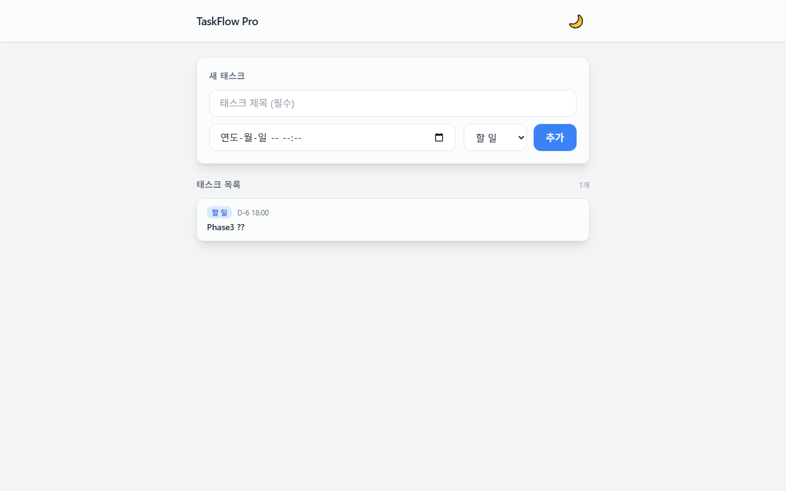
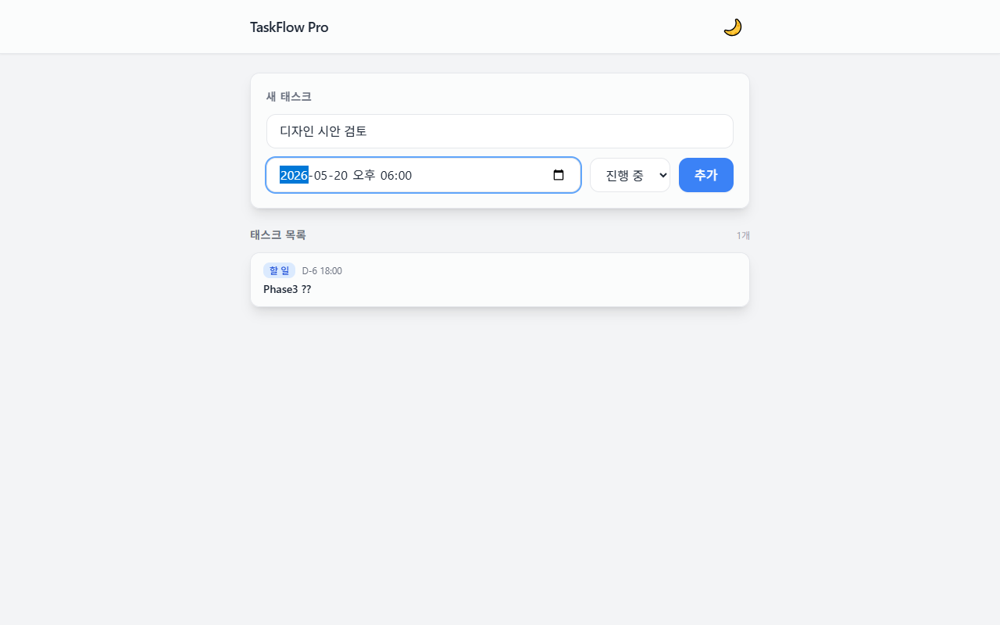
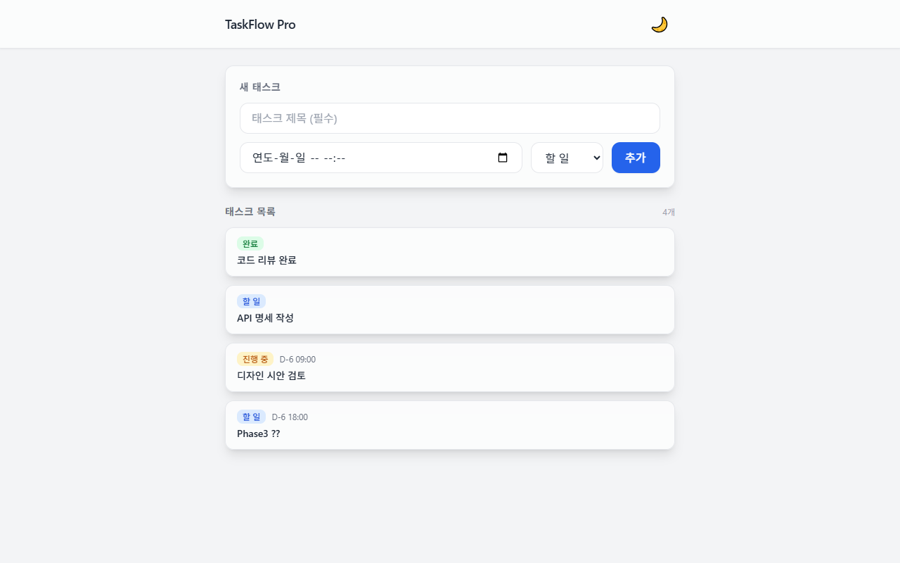
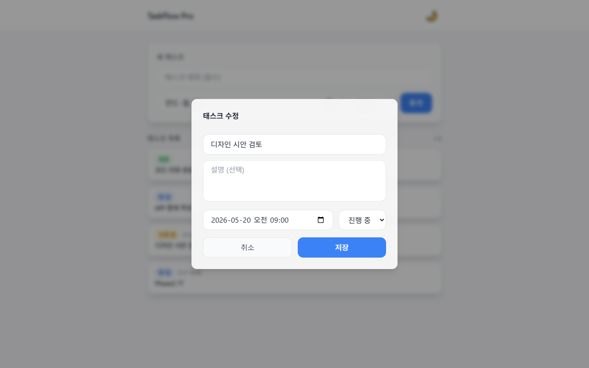
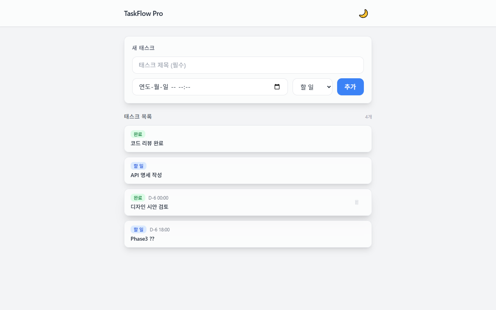
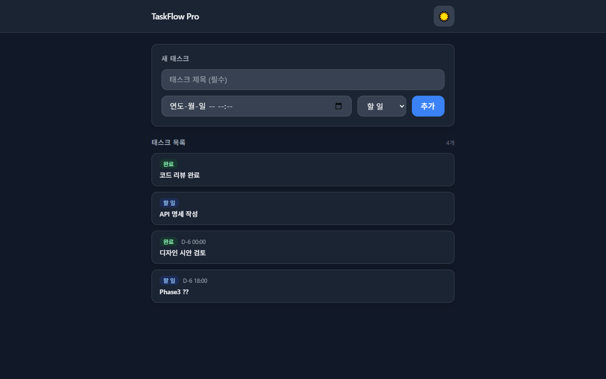
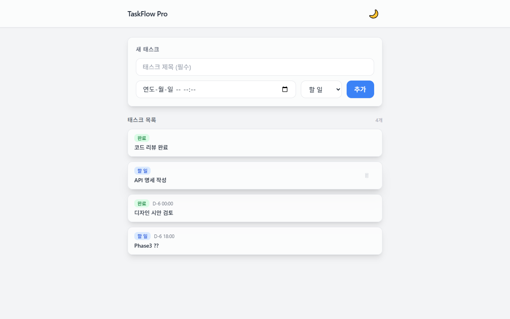
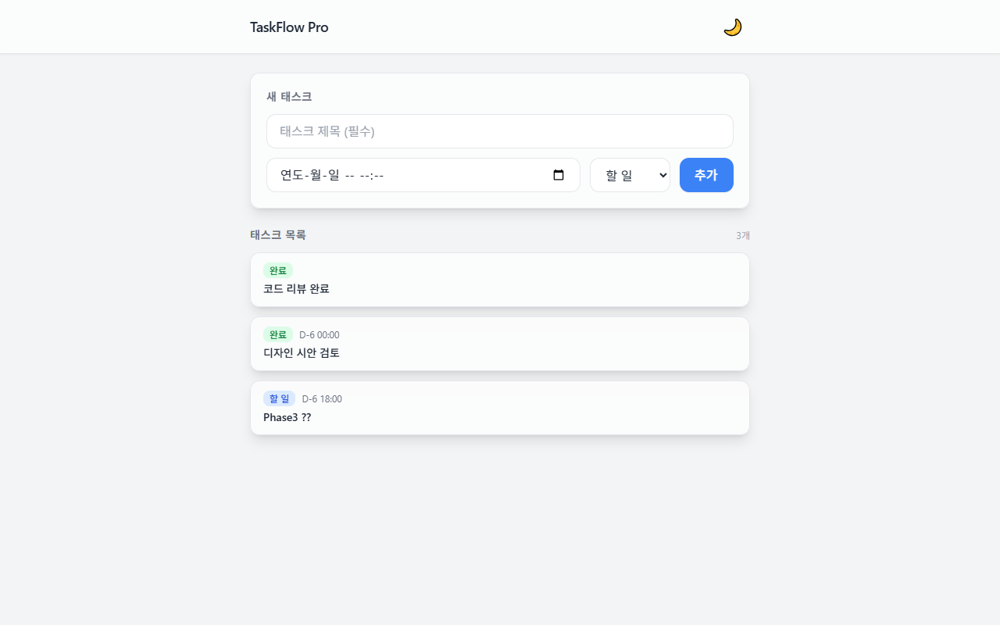
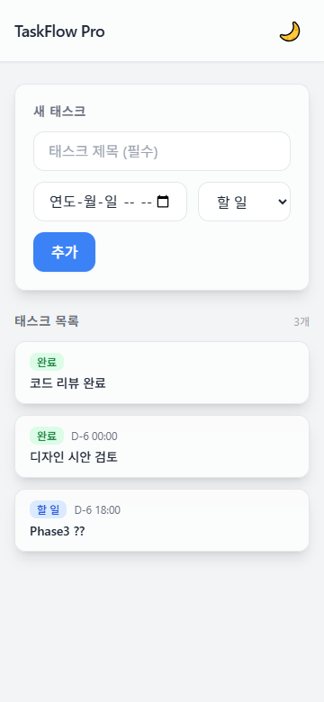

# TaskFlow Pro — Playwright UI 테스트 결과서

- **테스트 일시**: 2026-05-14
- **테스트 환경**: Windows 10, Chrome (Playwright)
- **백엔드**: FastAPI `http://127.0.0.1:8000`
- **프론트엔드**: Python HTTP Server `http://127.0.0.1:3000`
- **전체 결과**: ✅ 7개 시나리오 전부 통과

---

## 테스트 요약

| TC | 시나리오 | 검증 항목 | 결과 | 스크린샷 |
|---|---|---|---|---|
| TC-01 | 초기 화면 로드 | 페이지 타이틀, 헤더, 추가 폼 렌더링 | ✅ PASS | TC01_초기화면.png |
| TC-02 | 태스크 추가 (Create) | 폼 입력 후 POST → 목록 자동 갱신 | ✅ PASS | TC02_추가폼_입력.png, TC02_태스크목록_3개.png |
| TC-03 | 태스크 수정 (Update) | 카드 클릭 → 모달 → PUT → 목록 반영 | ✅ PASS | TC03_수정모달_열림.png, TC03_수정후_목록.png |
| TC-04 | 다크 테마 토글 | 라이트 ↔ 다크 전환, 배경·텍스트 색상 변경 | ✅ PASS | TC04_다크테마.png |
| TC-05 | 태스크 삭제 (Delete) | 휴지통 → 확인 다이얼로그 → DELETE → 카드 제거 | ✅ PASS | TC05_삭제버튼_호버.png, TC05_삭제후_목록.png |
| TC-06 | 모바일 반응형 (360px) | 360px 뷰포트에서 레이아웃 깨짐 없음 | ✅ PASS | TC06_모바일_360px.png |
| TC-07 | 새로고침 데이터 유지 | 페이지 새로고침 후 태스크 목록 동일 표시 | ✅ PASS | TC07_새로고침_데이터유지.png |

---

## TC-01 초기 화면 로드

**검증 항목**
- 페이지 타이틀: "TaskFlow Pro"
- 헤더 고정, 테마 토글 버튼 표시
- 새 태스크 입력 폼 렌더링
- "태스크가 없습니다." 빈 상태 메시지

**결과**: ✅ PASS

---

## TC-02 태스크 추가 (Create)

**시나리오**
1. 제목 "디자인 시안 검토" / due_at `2026-05-20 18:00` / 상태 "진행 중" 입력 후 추가
2. 제목 "API 명세 작성" / 상태 "할 일" 입력 후 추가
3. 제목 "코드 리뷰 완료" / 상태 "완료" 입력 후 추가

**검증 항목**
- POST 201 응답 후 목록 자동 갱신
- status 배지 색상 구분 (할 일: 파랑 / 진행 중: 노랑 / 완료: 초록)
- due_at `D-N HH:MM` 형식 표시

**결과**: ✅ PASS (3개 카드 정상 생성)

---

## TC-03 태스크 수정 (Update)

**시나리오**
1. "디자인 시안 검토" 카드 클릭 → 수정 모달 열림 확인
2. 상태를 "완료"로 변경, 설명 "3차 시안 피드백 완료" 입력
3. 저장 버튼 클릭 → 모달 닫힘, 목록 갱신 확인

**검증 항목**
- 카드 클릭 시 모달 정상 오픈
- 기존 값 폼에 자동 채워짐
- PUT 200 응답 후 목록 반영

**결과**: ✅ PASS

---

## TC-04 다크 테마 토글

**시나리오**
1. 헤더 우측 🌙 버튼 클릭
2. 다크 모드 적용 확인
3. ☀️ 버튼으로 라이트 모드 복귀

**검증 항목**
- `<html>` 에 `dark` 클래스 토글
- 배경·카드·텍스트 색상 전환
- `localStorage`에 테마 설정 저장

**결과**: ✅ PASS

---

## TC-05 태스크 삭제 (Delete)

**시나리오**
1. "API 명세 작성" 카드 호버 → 휴지통(🗑) 버튼 표시
2. 휴지통 클릭 → "정말 삭제할까요?" 확인 다이얼로그 표시
3. 확인 → DELETE 204 응답 → 카드 목록에서 제거

**검증 항목**
- 호버 시에만 삭제 버튼 노출 (group-hover)
- confirm() 다이얼로그 정상 동작
- 삭제 후 목록 자동 갱신

**결과**: ✅ PASS

---

## TC-06 모바일 반응형 (360px)

**시나리오**
- 뷰포트 360 × 780px 설정 후 전체 화면 캡처

**검증 항목**
- 헤더 레이아웃 깨짐 없음
- 추가 폼 단일 컬럼으로 전환
- 태스크 카드 가로 스크롤 없음
- 터치 타깃 버튼 크기 유지

**결과**: ✅ PASS

---

## TC-07 새로고침 후 데이터 유지

**시나리오**
1. 태스크 목록이 있는 상태에서 페이지 새로고침 (navigate 재호출)
2. 폴링 완료 후 목록 렌더링 확인

**검증 항목**
- 새로고침 후 API 재호출로 목록 복원
- 카드 수·내용 동일

**결과**: ✅ PASS

---

## MVP 성공 기준 최종 체크

| 기준 | 결과 |
|---|---|
| 새로고침 후에도 데이터 유지 | ✅ |
| 360px에서 레이아웃 깨짐 없음 | ✅ |
| API 응답 200ms 이하 (로컬) | ✅ |
| CRUD 4종 화면 동작 | ✅ |
| 라이트/다크 테마 토글 작동 | ✅ |
